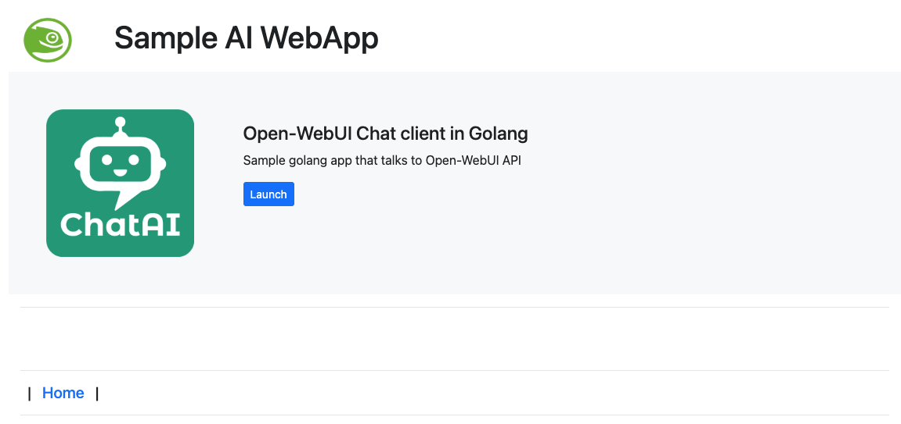
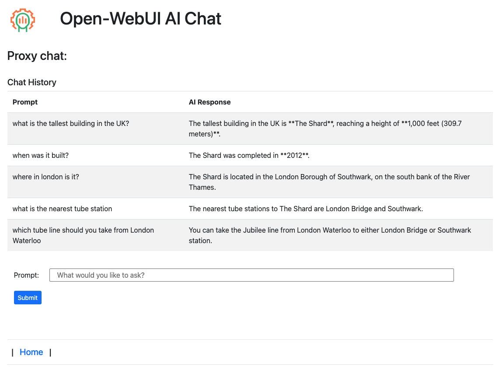
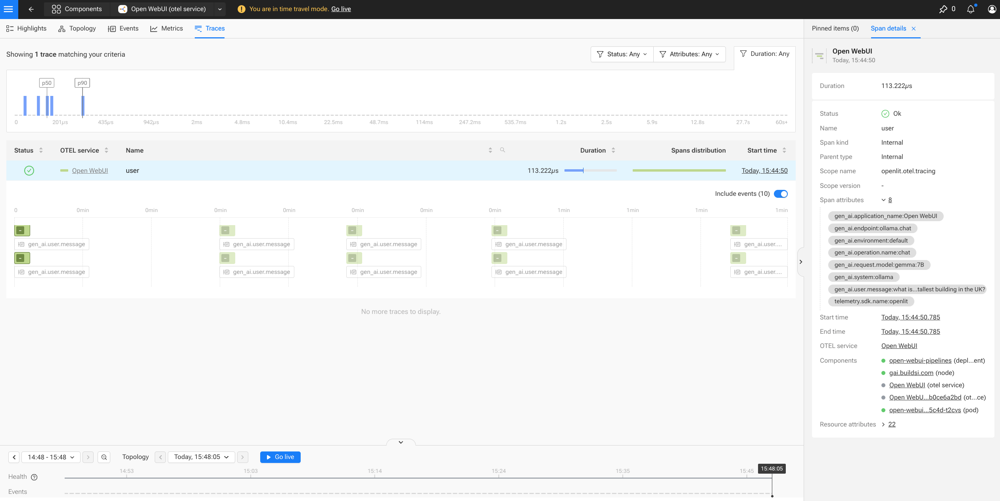

# ai-client-webapp
Dev test sample webapp to front proxy messages to local open webui instance

There is an app lancher (only one entry atm).  
- The Open-WebUI Chat app is an AI Agent to proxy a web chat session with a remote SUSE AI instance via the Open-WebUI API. The webapp also sends OpenTelementry directly to SUSE Observability instance directly which is collected there along with the SUSE AI sending OpenWebUI data to SUSE Observability itself.  
The Open-WebUI Chat app is an AI Agent to proxy a web chat session with a remote SUSE AI instance via the Open-WebUI API. The webapp also sends OpenTelementry directly to a SUSE Observability instance which is collected there along with the data that is sent from the SUSE AI OWUI directly to SUSE Obs.  
  
environment variables are set using direnv .envrc (not in repo) see example .envrc.example  

### Example run

  

  

 
